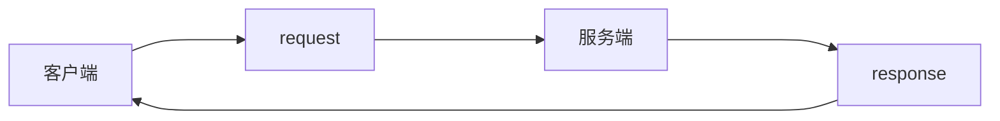

# 1.1 http网络基础

## 1.1.1什么是http？

http即超文本传输协议（Hyper Text Transfer Protocol ），是一个简单的请求-响应协议，它通常运行在TCP之上。它指定了客户端发给服务器什么样的信息以及得到什么样的响应。

## 1.1.2 http工作原理

1. 客户端与服务端建立连接。
2. 客户端向服务器提出请求。
3. 服务器接收请求，并根据返回相应的文件作出应答。
4. 客户端与服务器关闭连接。

##  1.1.3 报文格式

1. HttP报文是客户端到服务端的请求和从服务端到客户端的响应两部分构成。一个为请求报文，另一个为响应报文。
   - 请求报文：
     - 请求行
     - 通用信息头
     - 请求头
     - 实体头
     - 报文主体
     
   - 应答报文
     - 状态行
     
     - 通用信息头
     
     - 响应体
     
     - 实体头
     
     - 报文主体
## 1.1.4 请求

请求是客户端发往服务端的，分为四个部分。请求url，请求方法，请求头，请求体。这些内容都可以在网页浏览器的开发者工具中找到。

1. 请求url
 - 通俗的讲，这个是我们平常所输入的网页地址
2. 请求方法
 - 请求方法就是客户端用来发起请求的方式。一般有两种方式：POST和GET至于这两者的用途和差别在实战中我们会加以讲述。
3. 请求头
 - 请求头是客户端向服务端发起请求时，所携带的附加信息。
 - 类型（这些都可以在浏览器开发者工具中查看到）
   - Accept:浏览器可接受的MIME类型
   - Accept-charset:浏览器可接受的额字符集
   - Accept-Encoding:浏览器能够进行解码的数据编码方式
   - Accept-Language:浏览器所希望的语言种类
   - Cookie:用来进行客户端的认证
   - User-Agent:浏览器的类型。
4. 请求体
   - 一般承载多个请求参数的数据。大多数是POST请求的表单数据。
## 1.1.5 响应

响应式服务端接收请求后向客户端发出的信息，分为三个部分。响应头，响应状态码，响应体。

​	1.响应头

- 响应头，包含了服务端对请求的响应信息。有以下几种
  - Allow:服务器支持哪些请求方法
  - Content-Encoding:文档的编码方法
  - Content-Length:内容的长度。
  - Content-Type:文档的类型。Servlet默认为text/plain
2. 响应状态

   * 响应状态即服务器发出的一个HTTP状态码的信息头，用来响应浏览器的请求。下面列举了一些常见的状态码，具体请上网查看。

     | 状态码 | 描述                                           |
     | :----: | ---------------------------------------------- |
     |  200   | 请求成功                                       |
     |  404   | 服务器无法根据客户端的请求找到网页             |
     |  204   | 服务器成功处理，但未返回内容                   |
     |  405   | 客户端请求的方法被禁止                         |
     |  403   | 服务器理解请求客户端的请求，但是拒绝执行此请求 |
     |  408   | 服务器等待客户端发送的时间过长，请求超时       |

3. 响应体

   * 即响应的数据，包含网页的代码，图片的二进制数据，json数据。我们爬虫的目标就是为了获取这部分的内容。

以上就是我们本次的学习内容，知识点不太详尽，还需要大家再找找一些资料查看下。

--------------------------------------------------------------------------------------

参考内容：

1：《python3网络爬虫开发实战第2版》
2：菜鸟教程
3：百度百科-http

