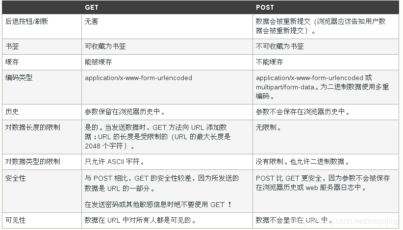

# 2.1Requests介绍
&emsp;&emsp;在上一章中，我们已经了解了一些有关爬虫的基础知识，并没有对其中提及的库做详细的介绍。本节内容将会为大家介绍Requests
库。这个Requests库在后面的内容将会用到很多，小伙伴们要好好学习啊！！！

## 2.1.1 快速上手
&emsp;&emsp;Requests库并不是python内置的库，如果我们想要使用它，我们就需要先安装它。我们在终端中输入下面的命令便可安装。
```commandline
pip install requests
```
&emsp;&emsp;如果在安装中遇到问题，请查看[参考内容](https://cuiqingcai.com/31034.html)

&emsp;&emsp;我们在后面的学习中和自己编写代码中，我们会经常遇到下面的内容。在这里，我们可以先记下来。具体的用法，我们在后面会介绍。


```python
import requests

# 通过get请求获取baidu的网页内容，并存入response变量（响应变量）
response = requests.get('https://www.baidu.com/')
# response响应类型
print(type(response))
# response响应状态码
print(response.status_code)
# 通过response.text查看响应内容，我们先来看一下response.text的类型
print(type(response.text))
# 打印网页内容，可以看到，它是一个html
print(response.text)
# 通过response.cookies获取cookie
print(response.cookies)
# 通过responese.content以字节的方式访问请求体。例如图片
print(response.content)
```

## 2.1.2 request对象
&emsp;&emsp;我们学习Requests,我们需要先了解request对象。request对象将一直伴随左右。如果像更好的了解，官方的API
是一个不错的选择。这里就不在过多介绍了。请查看[参考资料](https://docs.python-requests.org/zh_CN/latest/api.html#id2)

## 2.1.3 response对象
&emsp;&emsp;有关response对象的介绍，请查看[参考资料](https://docs.python-requests.org/zh_CN/latest/api.html#requests.Response)

&emsp;&emsp;下面将列举了一些常用的reponse属性，大家可以记下来。

```python
import requests

response = requests.get('http://www.baidu.com')
print(response.status_code)
print(response.headers)
print(response.cookies)
print(response.url)
print(response.history)
print(response.text)
print(response.content)
```

## 2.1.4 请求方式
&emsp;&emsp;Requests包含了多种请求方式，这里主要介绍常见的get和post两种请求方式，对于delete、put、options
请求方式有兴趣的同学可自行学习。

### 2.1.4.1 GET请求

#### 简单请求
下面是一个简单的GET请求，我们先以https://www.baidu.com为例。
```python
import requests
response = requests.get('http://www.baidu.com')
print(response.status_code)
```
我们会看到以下结果
```commandline
200
进程已结束，退出代码为 0
```
这时，我们就已经成功发起了GET请求，并返回了响应码。

#### 传递URL参数
如果我们想让我们的GET请求携带一些额外参数，我们应该怎么做呢？下面给出示例。
1. 根据URL分析来构建我们带参数的URL

```python
import requests

# 请求格式一: url?GET参数1=参数1内容&GET参数2=参数2内容
response = requests.get("https://www.baidu.com/s?wd=datawhale")  
print(response.text)
response = requests.get("https://www.baidu.com/s?wd=datawhale&oq=datawhale")  
print(response.text)
```
2. 使用params关键字参数
```python
# 请求格式二: 使用params参数传参
data = {
    'wd': 'datawhale',
    'oq': 'datawhale'
}
response = requests.get("https://www.baidu.com/s", params=data)
print(response.text)
```


### 2.1.4.2 POST请求

&emsp;&emsp;我们在实际应用中，我们需要向服务器提交表单数据。例如登录，上传文件。这时，我们就需要用POST请求方式。要实现POST
请求方式很简单。我们只需要用一个data关键字参数。
```python
import requests

data = {'name': 'datawhale', 'age': '4'}
response = requests.post("http://httpbin.org/post", data=data)
print(response.text)
```
下面是运行结果。我们可以看到在form中包含我们所提交的数据
```text
{
"args": {}, 
"data": "", 
"files": {}, 
"form": {
    "age": "4", 
    "name": "datawhale"
}, 
·······
"json": null, 
"origin": "112.26.184.61", 
"url": "http://httpbin.org/post"
}
```
### 2.1.4.3 GET和POST对比

&emsp;&emsp;我们用下面图列举两者的差别。


##2.1.5 定制请求头

&emsp;&emsp;我们在访问网站时，网站的服务器往往会根据User-Agent
来判断是浏览器还是爬虫程序。如果是爬虫程序，服务器将会断开此次请求，我们也就不能从网站获取我们想要的数据。因此我们可以通过添加请求头，模拟浏览器进行访问。对于Requests所提供的请求方式，我们都可以进行自定义请求头。

```python
import requests

data = {'name': 'datawhale', 'age': '4'}
headers = {"User-Agent": "Mozilla/5.0 (Windows NT 10.0; Win64; x64) AppleWebKit/537.36 (KHTML, like Gecko) Chrome/54.0.2840.99 Safari/537.36"}

response = requests.post("http://httpbin.org/post", data=data, headers=headers)
print(response.text)
```

## 2.1.6 JSON响应
&emsp;&emsp;我们在访问网站时，我们可能会遇到Json格式的响应内容。如果我们需要获得其中的内容，我们就需要json()方法来处理json格式的内容。
json()方法返回response的JSON对象。

```python
import requests

data = {'name': 'datawhale', 'age': '4'}
response = requests.post("http://httpbin.org/post", data=data)
content = response.json()  # 结果是一个字典
print(content)
print(content['form']['age'])  # 通过key获取value值
```

## 2.1.7 获取二进制数据
&emsp;&emsp;
我们在抓取网页中的图片或者视频通常以二进制方式存储在服务器中。我们在获取响应的内容时也是以二进制的方式获得的。那么，我们怎样获得呢？我们可以使用 
response 对象的 content 属性。同时，Requests会自动为你解码 gzip 和 deflate 传输编码的响应数据。

```python
import requests

response = requests.get("https://github.com/favicon.ico")
with open('需要保存的文件路径', 'wb') as f:
    f.write(response.content)
    f.close()
```
## 2.1.8 上传文件
&emsp;&emsp;
我们在日常生活中，我们有时需要向服务器上传某些文件进行处理，以满足我们的需求。如果你不想手动操作，而是想用代码来实现，下面的代码将会给你一个好的启发。
```python
import requests

files = {'file': open('你自己文件的路径', 'rb')}
response = requests.post("http://httpbin.org/post", files=files)
print(response.text)
```


## 2.1.9 响应状态码
&emsp;&emsp;我们有时想判断访问有没有成功，我们可以用状态码来进行验证。代码如下
```python
import requests

response = requests.get('http://www.baidu.com')
print(response.status_code)
```

### 部分响应状态码

| 状态码 | 说明                                                         |
| :----: | ------------------------------------------------------------ |
|  100   | 继续 (continue)                                              |
|  101   | 切换协议 (switching_protocols)                               |
|  200   | 成功 ('ok', 'okay', 'all_ok', 'all_okay', 'all_good', '\\o/', '✓') |
|  201   | 已创建 (created)                                             |
|  202   | 已接受 (accepted)                                            |
|  203   | 非授权信息 ('non_authoritative_info', 'non_authoritative_information') |
|  204   | 无内容 (no_content)                                          |
|  205   | 重置内容 ('reset_content', 'reset')                          |
|  206   | 部分内容 ('partial_content', 'partial')                      |

#### 重定向

| 状态码 | 说明                                            |
| ------ | ----------------------------------------------- |
| 300    | 多种选择 (multiple_choices)                     |
| 301    | 永久移动 ('moved_permanently', 'moved', '\\o-') |
| 302    | 临时移动 (found)                                |

#### 客户端错误

| 状态码 | 说明                                                         |
| ------ | :----------------------------------------------------------- |
| 400    | 错误请求 ('bad_request', 'bad')                              |
| 401    | 未授权 (unauthorized)                                        |
| 403    | 禁止 (forbidden)                                             |
| 404    | 未找到 ('not_found', '-o-')                                  |
| 405    | 方法禁用 ('method_not_allowed', 'not_allowed')               |
| 406    | 不接受 (not_acceptable)                                      |
| 407    | 需要代理授权 ('proxy_authentication_required', 'proxy_auth', 'proxy_authentication') |
| 408    | 请求超时 ('request_timeout', 'timeout')                      |
| 409    | 冲突 (conflict)                                              |
| 410    | 已删除 (gone)                                                |
| 411    | 需要有效长度 (length_required)                               |
| 412    | 未满足前提条件 ('precondition_failed', 'precondition')       |
| 413    | 请求实体过大 (request_entity_too_large)                      |
| 414    | URI过长 (request_uri_too_large)                              |
| 415    | 不支持的媒体类型 ('unsupported_media_type', 'unsupported_media', 'media_type') |

#### 服务器错误

| 状态码 | 说明                                                         |
| ------ | ------------------------------------------------------------ |
| 500    | 服务器内部错误 ('internal_server_error', 'server_error', '/o\\', '✗') |
| 501    | 尚未实施 (not_implemented)                                   |
| 502    | 错误网关 (bad_gateway)                                       |
| 503    | 服务不可用 ('service_unavailable', 'unavailable')            |
| 504    | 网关超时 (gateway_timeout)                                   |
| 505    | HTTP版本不支持 ('http_version_not_supported', 'http_version') |


## 2.1.10 其他应用

### 2.1.10.1 Session维持

&emsp;&emsp;我们在遇到一些需要登录的网站时，我们需要用session对象来维持。为什么需要用Session
维持呢？在第一章节中，我们提到HTTP
请求是无状态的，也就是说每次向服务器发出的请求都是新的请求，因此，我们需要一个中间件来帮助我们将前后的两次请求联系起来。这时候Session和Cookie
就派上用场了。

不使用Session会话维持
```python
import requests

requests.get('http://httpbin.org/cookies/set/number/123') #设置cookie
response = requests.get('http://httpbin.org/cookies')
print(response.text)
```
我们得到的效果
```python
{
  "cookies": {}
}
```
我们在使用Session维持
```python
import requests

s = requests.Session()
s.get('http://httpbin.org/cookies/set/number/123')
response = s.get('http://httpbin.org/cookies')
print(response.text)
```
我们得到的效果
```text
{
  "cookies": {
    "number": "123"
  }
}

```
&emsp;&emsp;我们对比两次结果，我们很容易知晓其中的差别。因此掌握Session维持，将是我们在后面应用中利器，让我们不再担心Cookie问题。

### 2.1.10.2 超时设置
&emsp;&emsp; 在请求时使用timeout来设置超时时间，并通过ReadTimeout捕获超时异常。
```python
import requests
from requests.exceptions import ReadTimeout
try:
    response = requests.get("http://httpbin.org", timeout = 0.2)
    print(response.status_code)
except ReadTimeout:
    print('Timeout')
except ConnectionError:
    print('Connection error')
except RequestException:
    print('Error')
```

### 2.1.10.3 错误与异常
- 当我们遇到网络问题时，Requests 会抛出一个 ConnectionError 异常。
- 当HTTP请求返回不成功的状态码时，Response.raise_for_status() 会抛出一个 HTTPError 异常。
- 若请求超时，则抛出一个 Timeout 异常。
- 若请求超过了设定的最大重定向次数，则会抛出一个 TooManyRedirects 异常。

&emsp;&emsp;对于错误和异常，请查看[参考资料](https://docs.python-requests.org/en/latest/api/)

## 2.1.11 小节
&emsp;&emsp;本小节，我们学习了Requests库。了解了一些简单的用法和高级用法，希望小伙伴们要牢牢掌握Requests!!!
- 参考资料
  - [python学习笔记(requests模块)](https://blog.csdn.net/mkgdjing/article/details/87776319)
  - [requests官方文档](https://docs.python-requests.org/zh_CN/latest/index.html)
  - python3网络爬虫开发实践第二版