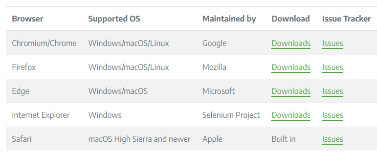

# 4.1 Selenium介绍和环境准备

## 4.1.1 Selenium介绍

&emsp;&emsp; Selenium是一个用于Web
应用程序的测试工具，它是既个测试工具，也是一个爬虫的利器。他能模仿用户的行为，做到所见及所爬，较容易获得我们所需要的数据，但缺点就是爬取的速度不是很快。接下来一起学习Selenium吧！！！

## 4.1.2 环境安装

1. 安装Selenium

```
pip install selenium
```

2. 安装浏览器驱动程序
    1. 准备一个浏览器。我这里使用的是Edge.
    2. 访问<https://www.selenium.dev/documentation/webdriver/getting_started/>,
       然后点击 **Install browser drivers**, 找到对应自己使用浏览器，下载对应的浏览器驱动程序。
       
    3. 选择对应浏览器的版本进行下载。
    4. 一定要注意浏览器和浏览器驱动程序的版本，不对应会报错。
3. 环境变量的配置
   1. Windows下，我们可以将下载的可执行程序拖放到python的Scripts目录下。
   2. 在liunx，Mac下，需要将可执行文件配置到环境变量或将文件移动到属于环境变量的目录里
   3. 如上面感觉较麻烦，我们可以在编写程序时进行显式调用。
    ```python
    from selenium.webdriver.chrome.service import Service
    from selenium import webdriver
    service = Service(executable_path="#自己安装的位置")
    driver = webdriver.Chrome(service=service)
    ```
   
4. 验证

```python
from selenium import webdriver

edge = webdriver.Edge()
edge.get('https://www.baidu.com')
```
&emsp;&emsp;如果能成功打开浏览器，看到百度的首页，那么就配置好了，接下来就可以开启Selenium学习之旅💪🏽💪🏽💪🏽

### 4.1.3 总结
&emsp;&emsp;本节主要是Selenium环境配置，配置好环境，接下来可以继续学习。

- 参考资料
  - [Selenium官方网站](https://www.selenium.dev/)
  - [ChromDiver的安装](https://cuiqingcai.com/31043.html)